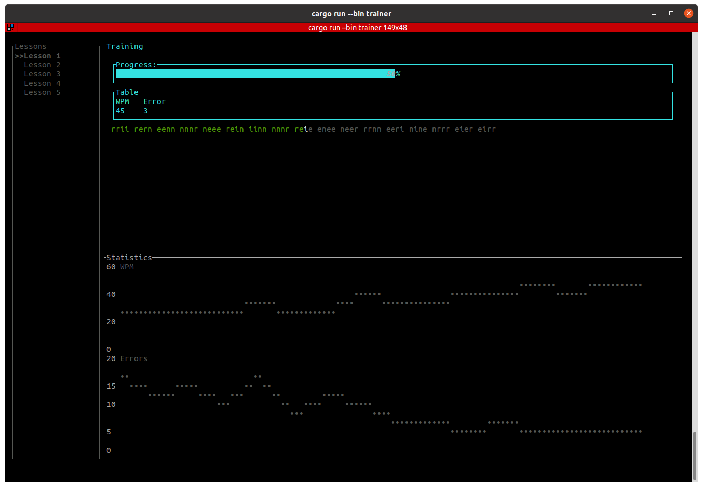

# Typing Trainer
Practice project for getting familiar with rust. 

Current features
- Lesson content is randomly generated
- Command line gui build with tui


### Usage
#### Generate save file with lesson definitions
At the moment only a few lessons are defined for the [Bone](https://www.neo-layout.org/Layouts/bone/) keyboard layout. They can be genreated using: 
```
cargo run --bin create_bone_lessons
```
### Starting the typing trainer
```
cargo run --bin trainer
```
- Select lessons using up/down key start by pressing `Enter`
- Type until you had enough of the selected lesson
- When in training mode press `Esc` to return to lesson selection
- When in lesson selection mode press `Esc` to save and exit the application

